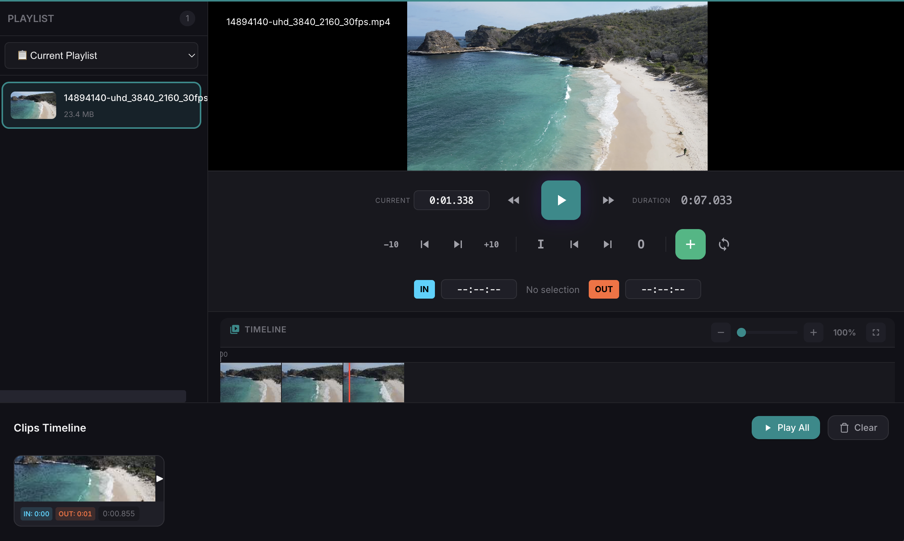

# Changelog

All notable changes to TronVid will be documented in this file.

The format is based on [Keep a Changelog](https://keepachangelog.com/en/1.0.0/),
and this project adheres to [Semantic Versioning](https://semver.org/spec/v2.0.0.html).

## [1.8.1] - 2026-02-28

### Added
- **📋 Auto-Clipboard Detection** - Automatically detects video URLs when you copy them
  - TronVid comes to foreground when a video URL is copied
  - Large popup shows video icon, **title** (auto-fetched), and URL
  - One-click "Add to Playlist" with pulsing green button
  - Supports YouTube, Vimeo, Twitch, Dailymotion, HLS streams
  - No browser extension needed!

- **🌐 Browser Extension** - Optional Chrome/Firefox extension
  - Floating "Add to TronVid" button on video pages
  - Opens TronVid via `tronvid://` URL protocol
  - Supports all major browsers (Chrome, Edge, Brave, Firefox)
  - Located in `/browser-extension/` folder

### Features
- **Auto Video Title Fetching** - Video titles are automatically retrieved from YouTube/Vimeo/Twitch/Dailymotion
- **Always-on-Top Window** - Window stays visible for 3 seconds when URL detected
- **macOS Dock Bounce** - Critical bounce to get attention
- **Stream Persistence** - Saved playlists now properly recognize stream URLs when reloaded
- **isStreamUrl() / detectStreamType()** - Helper functions to identify streams from URLs

### Technical
- Clipboard monitoring every 1.5 seconds in main process
- `tronvid://add-stream?url=...&name=...` URL protocol handler
- `add-stream-from-browser` IPC event for browser extension
- `clipboard-video-detected` IPC event for in-app notifications
- New `window.addStreamToPlaylist()` global function

---

## [1.8.0] - 2026-02-28

### Added
- **📡 Multi-Platform Streaming** - Stream videos directly from popular platforms
  - **YouTube** - Full support with quality selection (360p to 4K)
  - **Vimeo** - Watch Vimeo videos directly in TronVid
  - **Dailymotion** - Stream Dailymotion content
  - **Twitch** - Watch VODs and clips
  - **YouTube Playlists** - Import entire playlists as saved playlists
  - **HLS Streams** - Play .m3u8 live streams
  - **Direct URLs** - Play MP4/WebM URLs directly

### Features
- **Quality Selection** - Choose video quality before playback (YouTube)
- **Auto Platform Detection** - URLs are automatically recognized
- **No External Tools Required** - All streaming libraries are integrated:
  - `@distube/ytdl-core` for YouTube
  - `@distube/ytpl` for YouTube playlists
  - `youtube-dl-exec` for Vimeo/Dailymotion/Twitch (auto-downloads yt-dlp binary)
- **Demo Streams** - Load sample HLS streams to test streaming functionality

### Technical
- New `streamPlayer.js` module for all streaming functionality
- HLS.js integration for adaptive streaming
- Integrated IPC handlers for secure stream URL fetching
- Platform-specific emoji indicators (🔴 YouTube, 🔵 Vimeo, 🟢 Dailymotion, 🟣 Twitch)

## [1.7.7] - 2026-02-09

### Added
- **🔍 Video Zoom** - Zoom into video preview (1x-5x magnification)
  - Mouse wheel zoom directly on video (no modifier key needed)
  - Zoom buttons (+/-/Reset) in control bar
  - Pan zoomed video by click-and-drag
  - Zoom level indicator

### Improved
- **Final Cut Pro Style Trimming**
  - I/O keys for IN/OUT points
  - JKL navigation (J=Rewind, K=Pause, L=Forward)
  - Frame-by-frame navigation with ← → keys
  - Shift+← → for 10-frame jumps
  - Draggable IN/OUT markers on timeline
  - Visual selection region with handles
  - Enter key to add clip to timeline
  - / key to play selection
- **Compact Editor Layout** - More screen space for video preview
  - Controls condensed into single rows
  - Reduced padding and font sizes
  - Timeline toolbar with zoom controls

- **Updated Help Modals** - All shortcuts in English
  - Video Player help with all features
  - Video Editor help with correct JKL shortcuts

### Fixed
- Memory leaks in thumbnail cache
- Proper cleanup on editor close

## [1.7.5] - 2026-01-02

### Fixed
- **Video Editor Export** - Fixed FFmpeg error code 254 when exporting videos
  - Videos without audio streams now export correctly (silent audio generated when needed)
  - URL-encoded file paths now properly decoded (handles spaces and special characters in filenames)
  - Better error reporting with FFmpeg stderr output for debugging

### Technical
- Added FFprobe audio stream detection before export
- Added `decodeURIComponent()` for file paths from video player source
- Improved filter_complex handling for mixed audio/video-only clips

## [1.7.4] - 2026-01-31

### Added
- **🎬 Video Editor** - Full video editing capabilities
  - Cut video clips with precise IN/OUT markers
  - Create clips from multiple videos
  - Drag & drop to reorder clips in timeline
  - Preview clips before export
  - Export merged clips as single video (MP4, WebM, MOV)
  - FFmpeg `filter_complex concat` for reliable merging
  - Frame-accurate trimming with scale/pad normalization
  - Real-time export progress indicator
  - Access all saved playlists from within editor

### Improved
- **Memory Management** - Comprehensive cleanup on window close
  - Video player resources released on editor close
  - Thumbnail cache properly cleared
  - All image elements explicitly freed
  - Temp files deleted on app exit
- **Performance** - Optimized for lower CPU/memory usage
  - No memory leaks from thumbnails
  - Clean temp directory handling
  - Proper DOM cleanup on playlist clear

### Fixed
- Timeline "Play All" and "Clear" buttons now properly aligned side by side

### Technical
- New `videoEditor.js` module for clip management
- `filter_complex` with `trim`, `setpts`, `scale`, `concat` filters
- App cleanup handlers for `will-quit` and `before-quit` events
- Automatic `tronvid_export_*` temp folder cleanup

## [1.7.2] - 2026-01-31

### Added
- **🎵 Audio Extraction** - Extract audio from videos as MP3, AAC, WAV, or FLAC
  - Choose from 4 audio formats with quality options (Normal, Good, Best)
  - Extract only A-B Loop section for precise clips
  - Saves to `~/Music/TronVid Audio/` folder
  - Press `E` to open the Audio Extract modal
  - Requires FFmpeg installed on system

### Technical
- New `extract-audio` IPC handler using FFmpeg
- FFmpeg auto-detection for macOS, Windows, and Linux
- Quality presets for each audio format

## [1.7.1] - 2026-01-30

### Added
- **Chapter Loop** - Click a preview thumbnail to loop that section (press `C` to toggle mode)
  - Visual feedback shows looped time range
  - Green highlight on progress bar indicates loop section
  - Green outline on active preview thumbnail
- **Secure IPC Bridge** - New `preload.js` with secure communication

### Security
- **Context Isolation** - Enabled `contextIsolation: true` for secure renderer process
- **Node Integration Disabled** - `nodeIntegration: false` prevents arbitrary Node.js access
- **Web Security Enabled** - `webSecurity: true` enforces same-origin policy
- **Content Security Policy** - Added strict CSP in HTML header
- **IPC Whitelist** - Only allowed channels can communicate between processes
- **Secure Shell Access** - Only validated URLs (http/https/mailto) can be opened externally

### Changed
- Renderer now uses `window.electronAPI` bridge instead of direct `require()`
- Modules are now inline in renderer.js for context isolation compatibility
- File drag & drop uses `webUtils.getPathForFile()` via secure bridge

### Technical
- New `src/preload.js` - Secure IPC bridge with channel whitelist
- `window.electronAPI` - invoke, send, on methods with validation
- `window.fileUtils` - Secure file path access for drag & drop
- `window.shellAPI` - URL-validated external link opening
- `window.platformInfo` - Read-only platform detection

## [1.6.4] - 2026-01-29

### Added
- **Help Modal** - Press `H` to view all keyboard shortcuts and features
- **A-B Loop** - Set start/end points to repeat a section (`[`, `]`, `\`, `L` keys)
- **5 Color Themes** - Dark (default), Light, Purple, Blue, Green (press `T` to cycle)
- **Video Statistics Overlay** - Resolution, aspect ratio, playback info (press `I`)
- **Mini Player Mode** - Compact window for multitasking (`Ctrl/Cmd + W`)
- **Frame-by-Frame Navigation** - Use `,` and `.` for precise frame control
- **About Modal** - Version info and credits

### Changed
- **Modular Architecture** - Code reorganized into separate modules:
  - `helpModal.js` - Help overlay functionality
  - `aboutModal.js` - About dialog functionality
  - `themes.js` - Theme system with 5 themes
  - `videoStats.js` - Video statistics display
  - `abLoop.js` - A-B loop point management
- **Upgraded Electron** - Now using Electron 40.0.0
- **Improved A-B Loop Button** - Single click to set/toggle, double-click to clear
- **Professional Documentation** - Updated README, CONTRIBUTING, and CHANGELOG

### Fixed
- A-B Loop double-click clearing now works correctly with click timing mechanism

### Technical
- Source files organized in `src/` directory
- Modules in `src/modules/` directory
- All 5 themes stored in localStorage
- A-B loop markers displayed on progress bar

## [1.0.0] - 2026-01-26

### Added
- Initial release of TronVid
- Multi-format video support (MP4, MOV, AVI, MKV, WebM)
- Playlist management with save/load functionality
- Cross-platform support (macOS, Windows, Linux)
- Modern dark-themed user interface
- Keyboard shortcuts for all major functions
- Screenshot capture with automatic saving to Pictures folder
- Shuffle and loop playback modes
- Playback speed control (0.25x - 2x)
- Picture-in-Picture mode
- Video preview thumbnails
- Volume control with mute option
- Drag and drop support for adding videos
- Collapsible sidebar for better viewing experience
- Video progress bar with seeking
- Current video name display
- Video count indicator

### Technical
- Built with Electron 28.0.0
- Native menus for each platform
- Local storage for playlists (userData)
- ASAR packaging for distribution

---

## Version History

### Versioning Scheme

We use [Semantic Versioning](https://semver.org/):

- **MAJOR** version for incompatible API changes
- **MINOR** version for new functionality (backwards compatible)
- **PATCH** version for backwards compatible bug fixes

### How to Upgrade

1. Download the new version from the [Releases](https://github.com/tron4x/tronvid/releases) page
2. Install the new version (your playlists will be preserved)
3. Enjoy the new features!

[Unreleased]: https://github.com/tron4x/tronvid/compare/v1.7.1...HEAD
[1.7.1]: https://github.com/tron4x/tronvid/compare/v1.6.4...v1.7.1
[1.6.4]: https://github.com/tron4x/tronvid/compare/v1.0.0...v1.6.4
[1.0.0]: https://github.com/tron4x/tronvid/releases/tag/v1.0.0
