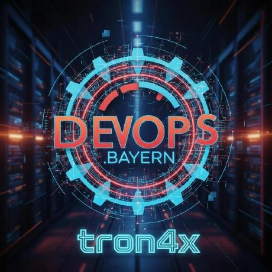

# 🎬 TronVid

<p align="center">
  
</p>

<p align="center">
  <strong>A modern, cross-platform video player with playlist support</strong>
</p>

<p align="center">
  <a href="#features">Features</a> •
  <a href="#installation">Installation</a> •
  <a href="#usage">Usage</a> •
  <a href="#keyboard-shortcuts">Shortcuts</a> •
  <a href="#building">Building</a> •
  <a href="#contributing">Contributing</a> •
  <a href="#license">License</a>
</p>

<p align="center">
  <a href="https://github.com/tron4x/tronvid/releases"></a>
  
  <a href="LICENSE"></a>
  
  
  <a href="https://github.com/tron4x/tronvid/issues"></a>
</p>

---

## ✨ Features

- 🎥 **Multi-Format Support** - Play MP4, MOV, AVI, MKV, and WebM videos
- 📂 **Playlist Management** - Create, save, and organize multiple playlists
- 🖥️ **Cross-Platform** - Works on macOS, Windows, and Linux
- 🎨 **Modern UI** - Clean, dark-themed interface with smooth animations
- ⌨️ **Keyboard Shortcuts** - Full keyboard control for power users
- 📸 **Screenshot Capture** - Take screenshots with one click
- 🔀 **Shuffle & Loop** - Shuffle playlist or loop current video
- 🎚️ **Speed Control** - Adjust playback speed (0.25x - 2x)
- 🖼️ **Picture-in-Picture** - Watch videos in a floating window
- 📺 **Video Previews** - Thumbnail strip for quick navigation
- 🔊 **Volume Control** - Adjustable volume with mute option
- 🖱️ **Drag & Drop** - Simply drop videos to add them

## 📦 Installation

### Download Pre-built Binaries

Download the latest release for your platform from the [Releases](https://github.com/tron4x/tronvid/releases) page.

| Platform | Download |
|----------|----------|
| macOS (Apple Silicon) | `TronVid-x.x.x-arm64.dmg` |
| macOS (Intel) | `TronVid-x.x.x-x64.dmg` |
| Windows | `TronVid-x.x.x-Setup.exe` |
| Linux | `TronVid-x.x.x.AppImage` |

### Build from Source

```bash
# Clone the repository
git clone https://github.com/tron4x/tronvid.git
cd tronvid

# Install dependencies
npm install

# Run in development mode
npm start

# Build for your platform
npm run build:mac    # macOS
npm run build:win    # Windows
npm run build:linux  # Linux
npm run build:all    # All platforms
```

## 🚀 Usage

### Adding Videos

1. **Drag & Drop** - Drag video files directly into the app
2. **File Selection** - Click "Files" to select individual videos
3. **Folder Selection** - Click "Folder" to add all videos from a directory

### Managing Playlists

- **Save Playlist** - Click the save icon to save your current playlist
- **Load Playlist** - Click on any saved playlist to load it
- **Delete Playlist** - Right-click a playlist to delete it
- **Clear Playlist** - Click "Clear Playlist" to remove all videos

## ⌨️ Keyboard Shortcuts

| Shortcut | Action |
|----------|--------|
| `Space` | Play / Pause |
| `N` | Next video |
| `P` | Previous video |
| `F` | Toggle fullscreen |
| `M` | Mute / Unmute |
| `L` | Toggle loop |
| `S` | Toggle shuffle |
| `←` | Seek backward 5s |
| `→` | Seek forward 5s |
| `↑` | Volume up |
| `↓` | Volume down |
| `Ctrl/Cmd + O` | Open files |
| `Ctrl/Cmd + Shift + O` | Open folder |
| `Ctrl/Cmd + B` | Toggle sidebar |

## 🔧 Building

### Prerequisites

- [Node.js](https://nodejs.org/) (v18 or later)
- [npm](https://www.npmjs.com/) (v9 or later)

### Build Commands

```bash
# Install dependencies
npm install

# Build for macOS
npm run build:mac

# Build for Windows
npm run build:win

# Build for Linux
npm run build:linux

# Build for all platforms
npm run build:all
```

Built applications will be in the `dist/` directory.

## 📁 Project Structure

```
tronvid/
├── src/                    # Source code
│   ├── main.js             # Electron main process
│   ├── renderer.js         # Renderer process (UI logic)
│   ├── index.html          # Main HTML file
│   └── styles.css          # Application styles
├── assets/                 # Static assets
│   └── logo.png            # Application logo
├── build/                  # Build resources
│   ├── icon.icns           # macOS icon
│   ├── icon.ico            # Windows icon
│   └── icon.png            # Linux icon
├── docs/                   # Documentation
├── package.json            # Project configuration
├── LICENSE                 # MIT License
├── README.md               # This file
├── CONTRIBUTING.md         # Contributing guidelines
├── CODE_OF_CONDUCT.md      # Code of conduct
├── CHANGELOG.md            # Version history
└── dist/                   # Built applications (generated)
```

## 🤝 Contributing

Contributions are welcome! Please read our [Contributing Guide](CONTRIBUTING.md) for details on the process for submitting pull requests.

1. Fork the repository
2. Create your feature branch (`git checkout -b feature/amazing-feature`)
3. Commit your changes (`git commit -m 'Add some amazing feature'`)
4. Push to the branch (`git push origin feature/amazing-feature`)
5. Open a Pull Request

## 📄 License

This project is licensed under the MIT License - see the [LICENSE](LICENSE) file for details.

## 👨‍💻 Author

**tron4x**

- GitHub: [@tron4x](https://github.com/tron4x)

## 🙏 Acknowledgments

- Built with [Electron](https://www.electronjs.org/)
- Icons and design inspired by modern media players

---

<p align="center">
  Made with ❤️ by <a href="https://github.com/tron4x">tron4x</a>
</p>
