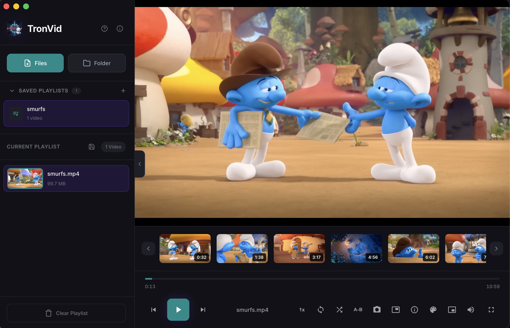
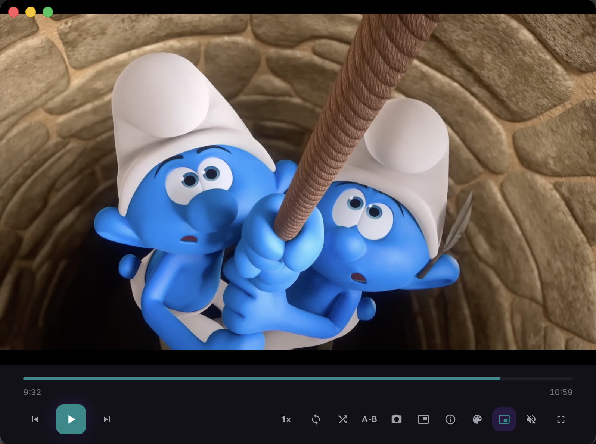

# 🎬 TronVid

  

  <strong>A modern, cross-platform video player</strong>

  <a href="#features">Features</a> •
  <a href="#installation">Installation</a> •
  <a href="#usage">Usage</a> •
  <a href="#keyboard-shortcuts">Shortcuts</a> •
  <a href="#building">Building</a> •
  <a href="#contributing">Contributing</a> •
  <a href="#license">License</a>

  
  
  
  
  
  

---

  
   
  <em>Main Window</em>

  
   
  <em>Mini Player</em>

---

## ✨ Features

### Core Features
- 🎥 **Multi-Format Support** - Play MP4, MOV, AVI, MKV, and WebM videos
- 📂 **Playlist Management** - Create, save, and organize multiple playlists
- 🖥️ **Cross-Platform** - Works on macOS, Windows, and Linux
- 🎨 **5 Color Themes** - Dark (default), Light, Purple, Blue, and Green
- ⌨️ **Full Keyboard Control** - Comprehensive shortcuts for power users

### Playback Features
- 🔁 **A-B Loop** - Set start/end points to loop a specific section
- 🔂 **Chapter Loop** - Click preview thumbnails to loop video sections (press `C`)
- 🎚️ **Speed Control** - Adjust playback speed (0.25x - 2x)
- 🔀 **Shuffle & Loop** - Shuffle playlist or loop current video
- 🎞️ **Frame-by-Frame** - Navigate frame by frame with `,` and `.` keys

### Security
- 🔒 **Context Isolation** - Secure renderer process with isolated context
- 🛡️ **Content Security Policy** - Strict CSP prevents XSS attacks
- 🔐 **Secure IPC** - Whitelist-based IPC communication

### Advanced Features
- 📸 **Screenshot Capture** - Save screenshots as PNG files
- 🖼️ **Picture-in-Picture** - Watch videos in a floating window
- 📺 **Video Previews** - Thumbnail strip for quick navigation
- 📊 **Video Statistics** - View resolution, bitrate, codec info
- 🪟 **Mini Player Mode** - Compact mode for multitasking
- ❓ **Built-in Help** - Press `H` for a complete feature guide

### User Experience
- 🖱️ **Drag & Drop** - Simply drop videos to add them
- 🔊 **Volume Control** - Adjustable volume with mute option
- 📁 **Collapsible Sidebar** - More space when you need it
- 🎯 **Reorderable Playlist** - Drag items to reorder

## 📦 Installation

### Download Pre-built Binaries

Download the latest release for your platform from the [Releases](https://github.com/tron4x/tronvid/releases) page.

| Platform | Download |
|----------|----------|
| macOS (Apple Silicon) | `TronVid-x.x.x-arm64.dmg` |
| Windows (64-bit) | `TronVid-x.x.x-win-x64.exe` |
| Windows (32-bit) | `TronVid-x.x.x-win-ia32.exe` |
| Linux (AppImage) | `TronVid-x.x.x-linux-x86_64.AppImage` |
| Linux (Debian) | `TronVid-x.x.x-linux-amd64.deb` |

---

  
  &nbsp;&nbsp;
  

<table align="center">
<tr>
<td>

### 🛡️ Safe & Secure Downloads

✅ **All binaries are virus-scanned** before every release  
✅ **No malware, no spyware, no harmful code**  
✅ **100% open source**  
✅ **Built transparently** with automated CI/CD pipelines  

**Download with confidence!** TronVid is safe to install and use.

</td>
</tr>
</table>

---

## 🚀 Usage

### Adding Videos

1. **Drag & Drop** - Drag video files directly into the app
2. **File Selection** - Click "Files" to select individual videos
3. **Folder Selection** - Click "Folder" to add all videos from a directory

### Managing Playlists

- **Save Playlist** - Click the 💾 icon to save your current playlist
- **Load Playlist** - Click on any saved playlist to load it
- **Create Playlist** - Click the ➕ icon to create a new empty playlist
- **Delete Playlist** - Click the ✕ button on any playlist to delete it
- **Clear Playlist** - Click "Clear Playlist" to remove all videos
- **Reorder** - Drag playlist items to change order

> **💡 How Playlists Work:**  
> TronVid stores only the **file paths** to your videos, not the actual video files. This means:
> - ✅ No disk space is wasted on duplicates
> - ✅ Playlists load instantly
> - ✅ Original files stay in their original location
> - ⚠️ If you move or delete a video file, the playlist entry won't work anymore
> 
> Playlists are saved locally in your user data folder and persist between sessions.

## 📁 Data Storage Locations

### Playlists

Playlists are stored as a JSON file in the app's user data directory:

| Platform | Location |
|----------|----------|
| macOS | `~/Library/Application Support/TronVid/playlists.json` |
| Windows | `%APPDATA%/TronVid/playlists.json` |
| Linux | `~/.config/TronVid/playlists.json` |

### Screenshots

Screenshots are saved as PNG files in a dedicated folder inside your Pictures directory:

| Platform | Location |
|----------|----------|
| macOS | `~/Pictures/TronVid Screenshots/` |
| Windows | `%USERPROFILE%/Pictures/TronVid Screenshots/` |
| Linux | `~/Pictures/TronVid Screenshots/` |

### A-B Loop

Repeat a specific section of the video:

1. Press `[` to set the start point (A)
2. Press `]` to set the end point (B) - loop starts automatically
3. Press `L` to toggle the loop on/off
4. Press `\` or double-click the A-B button to clear

### Themes

Press `T` to cycle through 5 color themes:
- **Dark** (default)
- **Light**
- **Purple**
- **Blue**
- **Green**

## ⌨️ Keyboard Shortcuts

### Playback

| Shortcut | Action |
|----------|--------|
| `Space` | Play / Pause |
| `N` | Next video |
| `P` | Previous video |
| `←` | Rewind 10 seconds |
| `→` | Fast forward 10 seconds |
| `,` | Previous frame (fine control) |
| `.` | Next frame (fine control) |

### Volume

| Shortcut | Action |
|----------|--------|
| `↑` | Volume up (+10%) |
| `↓` | Volume down (-10%) |
| `M` | Mute / Unmute |

### A-B Loop

| Shortcut | Action |
|----------|--------|
| `[` | Set loop start point (A) |
| `]` | Set loop end point (B) |
| `\` | Clear A-B loop |
| `L` | Toggle A-B loop on/off |

### Chapter Loop

| Shortcut | Action |
|----------|--------|
| `C` | Toggle chapter loop mode |
| Click Preview | Loop that section (when mode active) |

### View & Window

| Shortcut | Action |
|----------|--------|
| `F` | Toggle fullscreen |
| `Ctrl/Cmd + B` | Toggle sidebar |
| `Ctrl/Cmd + W` | Mini player mode |
| `I` | Toggle video statistics |
| `T` | Change theme |
| `H` | Open help modal |

### Other

| Shortcut | Action |
|----------|--------|
| `S` | Take screenshot |

## 📄 License

This project is licensed under the Apache License 2.0 - see the [LICENSE](LICENSE) file for details.

## 👨‍💻 Author

**tron4x**

- GitHub: [@tron4x](https://github.com/tron4x)

## 🙏 Acknowledgments

- Built with [Electron](https://www.electronjs.org/)
- Icons and design inspired by modern media players

---

  Made with ❤️ by <a href="https://github.com/tron4x">tron4x</a>

  <em>
    TronVid is developed and maintained by tron4x. While we strive for quality, 
    bugs may occur. We actively monitor and address reported issues. 
    Your feedback helps make TronVid better! 🚀 
     
    Thank you for your support and feedback! 🙏
  </em>

  <a href="https://github.com/tron4x/tronvid/issues">Report Bug</a>
  ·
  <a href="https://github.com/tron4x/tronvid/issues">Request Feature</a>

